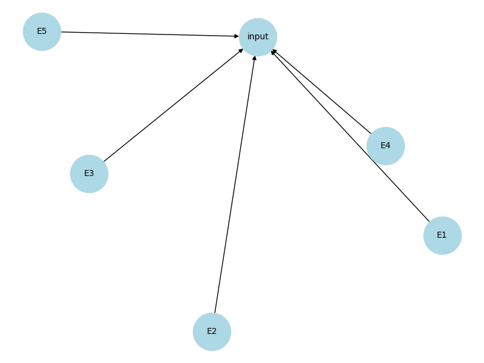

# The Agent's Goal
I am designing an agent for Super Smash Brothers Melee that tries to replicate the playstyles of the player data it is given. This means that it should display the way that the player combos and plays neutral, along with its technical skill.

There are a few ways of measuring this both quantitatively and qualitatively. Quantitatively, we can see how many times certain actions were performed in a match and see if that matches up with the average time the player does that action, such as dashdances, wavedashes, etc. Qualitatively, we can see the technical skill and choices the player makes. For example, whenever I play Fox McCloud, I go for a lot more technical and flashy moves for style and because I like pressing buttons. However, whenever my sister plays Fox McCloud, she plays him more methodically going for more raw punishes and shine spikes with less technical skill.

# Design Philophy
To create a melee agent that plays like a player, we should only be giving the agent information that only a human would have. That means that reading from the opponent's inputs directly would not be allowed. I will also be referring to the agent's output as "inputs" because those are the inputs into the controller and the agent is mimicking player inputs. Another thing we have to address is floating point values. A lot of values in melee such as speed, position, etc. are floating point which poses a very large problem for some networks. To mitigate this, I will be doing either one of two things. I will either make very large groups so that floating point values fit into ranges (ie. grouping by 0-10, 10-20, etc.) or I will not include floating point values in the networks but instead have them be a part of the probability function.

# Bayesian Training
Every match played through the Slippi client saves all of the player's inputs into a Slippi file indicated by a .slp file exention. I have not included any in the repository as my own collection totals to 20 GB of data. In training what it does is that it looks through all of the slippi files and finds the ones where the selected player and character are playing. It does this by either checking the player's tag or chosen costume color if it was played locally (for example, I play the Blue color Fox while my sister plays White or Orange Fox). After we deem a file relevant we replay the match and store relavent information about the game state (such as position, velocity, animation, invincibility, percent, shield health, etc.) as well as the input the player is doing on that frame. We will use this information to replicate the chosen playstyle. Essentially if the player did some input in a similar game state in the past, the agent will do it again depending on the similarity to the current game state to the past game state. Similarity is determined by a weighted euclidian distance and we compress the data by conjoining similar adjacent datapoints.

# Bayesian Network
The network is not very complex. There is the information we get from the screen and we just directly connect it to the agent's controller inputs. There are a few things to note though. 

We will be considering the inputs as a whole to be one node. This is because some actions require a combination of inputs (such as wavedashing and rolling needing a direction and L / R trigger press or attacks needing a direction and button). If we have them seperate then a 40% chance of wavedashing would actually have a 40% chance of the correct direction, 40% chance of pressing the trigger meaning an actual 16% chance of wavedashing, which would not be accurate in representing the player. Thus, we will be grouping the inputs as one whole. This has the downside of no unique combinations of inputs, but inputs are limited so its not the biggest deal.

This means that the Bayesian probability we want to solve for is $P(input | E_1, E_2, ..., E_n)$ where $E_1, E_2, ..., E_n$ are the individual and independent environment variables. This is a CPT that we need to calculate for each input possibility and then do the actual input on the frame. The naive way of finding this probability is to simply do $P(input | E_1, E_2, ..., E_n) = \frac{P(input,E_1, E_2, ..., E_n)}{P(E_1, E_2, ..., E_n)}=\frac{P(input,E_1, E_2, ..., E_n)}{\prod_{i=1}^{n}P(E_i)}$ which is equivalent to the number of times we see an input and environment combination each time we are in that environment. However, we cannot do this because the number of times where $E_1, E_2, ..., E_n$ will be $0$ a significant number of times. This is not an issue of lack of data, however. It has been said that after 10-15 moves in chess, a new board state is reached that has never before been seen. If a simpler game like chess can reach complex states, you can imagine the wide variety in a game like melee. Thus, we do two different things to solve this issue.

## Treat Floats Differently

A lot of the way that we treat Bayesian probability with data is 0 or 1; either this data point exists or it does not. If we make the dependency in the joint probability be variable depending on how close integer and float values in the data are to the real scenario and weight probabilities that way, then we can solve this always 0 issue.

## Hold previous value

If we hit a spot where we have never seen before, it is a safe bet to just do nothing. Most of the time players aren't making radical motion switches every frame, they simply make minor adjustments frame by frame anyways.

# Milestone 2 Questions
**Explain what your AI agent does in terms of PEAS. What is the "world" like?**

The performance measure of the Bayesian agent is how accurately does the agent portray the training data in terms of style of play (such as which options does it select, how it combos, moves, plays neutral, etc.). The environment is simply the Super Smash Bros. Melee gameplay with Slippi data. The actuators are the controller inputs that it is outputting each game frame. Its sensors are the information it gets about itself, the opponent and the stage. The world to this agent is just the vector I gave it that has a lot of information such as stock count, percent, jumps left, etc.

**What kind of agent is it? Goal based? Utility based? etc.**

This agent is right now just Table Driven. It has a simple lookup table of all inputs and what situation they were done in. This is simply what has to be done for a Bayesian network; they are often just LUTs of CPTs.

**Describe how your agent is set up and where it fits in probabilistic modeling**

It is a Bayesian network as I described earlier. The probability function is simply a weighted distance function between the the states and then it will use probability to determine what is the most likely input for the player it is training on.

**What is the conclusion of your 1st model? What can be done to possibly improve it?**

This was definetly one of the most simple ways to make an AI and it honestly kind of works which is impressive. You can see that when trained on technical gameplay, it attempts to do those technical abilities but it fails due to it having no understanding of past and future. For example, a common tech I do is called a shield drop, where I move the stick forward, hold a trigger, then move the stick down a notch. The issue with this in the Bayesian network is that all it sees is that the gamestate is shielding on a platform, so it tries to hold forward and down and just ends up doing a different action (like rolling or spotdodging), which in turn makes the future gamestates not about shielding and instead about rolling or spotdodging. It does sometimes manage to do technical things and for simpler techniques (like fastfalling where you simply press down after the peak of your jump). It correctly does it multiple times if the player it is replicating does it often (like me) and it doesnt do it if the replicated player doesn't do it often (like my sister). It is, however, far from being good. Without knowing the past states, it doesn't have any semblance of plan so each decision is made independent of the previous one. Take, for example, Fox dashing away from Marth. That could mean that Fox was either dash dancing, whiff punishing, pivoting, or actually running away. The Bayesian Network has no idea which option it is without knowing previous states. However, Hidden Markov Models, which are conditioned on previous states, would most likely be able to differentiate between these options and then do a more accurate input accordingly. The current Bayesian Network will just pick by the probability of the gameplan rather than the gameplan itself. Going back to that Fox Marth example, if the Fox was pivoting but the data says that this player pivots only 10% of the time, then each frame it will only choose to continue doing the pivot 10% of the time, which quickly degrades into it rapidly switching gameplans. Overall, it is still better than random inputs and when my friends played against the bot, they could tell that it was trained off of me (and even joked whenever it made a mistake that that is a mistake I would do).