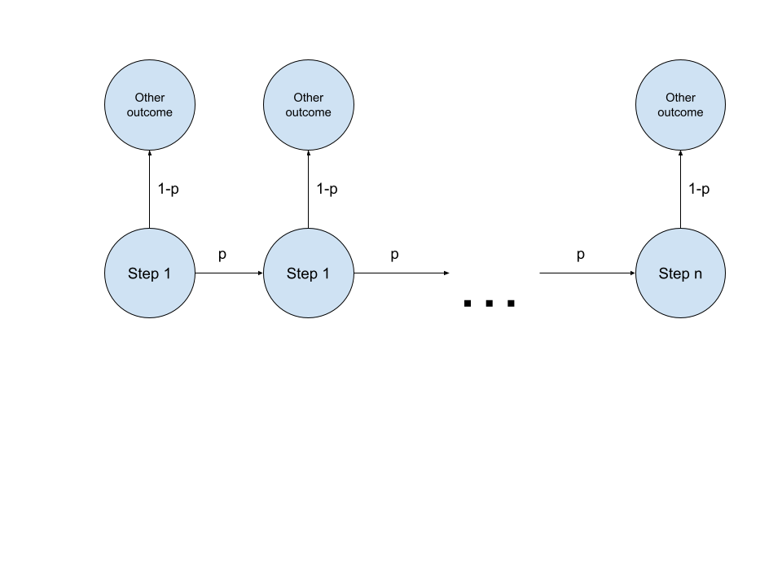

# Melee Agent (Milestone 3)
## PEAS/Agent Analysis
**Describe your agent in terms of PEAS and give a background of your task at hand.**
I am designing an agent for Super Smash Brothers Melee that tries to replicate the playstyles of the player data it is given. This means that it should display the way that the player combos and plays neutral, along with its technical skill.

There are a few ways of measuring this both quantitatively and qualitatively. Quantitatively, we can see how many times certain actions were performed in a match and see if that matches up with the average time the player does that action, such as dashdances, wavedashes, etc. Qualitatively, we can see the technical skill and choices the player makes. For example, whenever I play Fox McCloud, I go for a lot more technical and flashy moves for style and because I like pressing buttons. However, whenever my sister plays Fox McCloud, she plays him more methodically going for more raw punishes and shine spikes with less technical skill.

The performance measure of the Bayesian agent is how accurately does the agent portray the training data in terms of style of play (such as which options does it select, how it combos, moves, plays neutral, etc.). The environment is simply the Super Smash Bros. Melee gameplay with Slippi data. The actuators are the controller inputs that it is outputting each game frame. Its sensors are the information it gets about itself, the opponent and the stage. The world to this agent is just the vector I gave it that has a lot of information such as stock count, percent, jumps left, etc.

## Agent Setup, Data Preprocessing, Training setup
**Give an exploration of your dataset, and highlight which variables are important. Give a brief overview of each variable and its role in your agent/model**
The dataset are a collection of Slippi files. Whenever a game of melee is played on the Slippi client it saves a replay of the game by saving every input from every player on every frame. When reading the file, it will then replay the game by doing the same inputs at the same times to give you the gamestate at each frame. There are a lot of variables at play, here are the ones that I used. These variables are gotten for each frame of the gameplay

- *playerstate.off_stage*
This is a helper variable that tells whether a character is off stage or not. This is to assist the agent is understanding when to recover, as being off stage is mostly a bad thing and leads to a loss of a life.

- *playerstate.facing*
This is important for the agent to know as some inputs will do entirely different moves based on where the character is facing (for example, if facing right, doing C-right in the air would do a "forward aerial" but doing C-right facing left would do a "backward aerial")

- *playerstate.on_ground*
This is also a helper variable that is key as again, some moves can only be done on the ground versus on the air.

- *playerstate.jumps_left*
This variable indicates how many jumps does the player have, which for most characters is between 0-2.

- *playerstate.stock*
This variables is how many lives does the player have left in the game.

- *playerstate.position*
Self explanatory, the (x, y) tuple position relative to the center of the stage.

- *playerstate.speed_air_x_self*
- *playerstate.speed_ground_x_self*
- *playerstate.speed_x_attack*
- *playerstate.speed_y_attack*
- *playerstate.speed_y_self*
These five variables represent speed in some way. The way melee's engine works is complicated, so it separates air and ground x velocity but has only one value for y velocity. The attack speed variables are used if an attack will give velocity to the character (like how certain moves move the character upwards a lot)

- *playerstate.percent*
In platform fighters like melee, instead of health characters have a percentage that indicates how far they get knocked back when they get hit.

- *playerstate.hitstun_frames_left*
When hit by a move, there is a certain window where a character can not do anything. This is reffered to as "hitstun". This variable is how many frames (or 1/60th seconds) does a character have before they can do actions again. There are some important things a character can do in hitstun, however, so we add this as a variable.

- *playerstate.invulnerability_left*
In some circumstances, a player can get a small duration of invincibility where they do not take damage or knockback upon being hit.

- *playerstate.shield_strength*
In melee, your shield has a health from 0 to 60 and this variable stores that.

- *valueWeighting*
For each of the players, we store all of the playerstate variables into an array that the agent will compare with the gamestate using the euclidian distance weighted by this valueWeighting array. This weighted array is the "observation" in our HMM and valueWeighting ensures that all values get weighted according to how prevalent they are to the hidden state.

- *playerstate.action*
I am putting the variable separate because this variable is our hidden state in our HMM. This is the presumed action that the player is doing but we cannot determine that during the match so it is hidden. However, we have access to it in playback, so we can use this to train our transition and observation probabilities.

**Describe in detail how your variables interact with each other, and if your model fits a particular structure, explain why you chose that structure to model your agent. If it does not, further elaborate on why you chose that model based on the variables.**

For this milestone I wanted to fix the problems of the last agent, meaning this new agent should
- have some understanding of past actions and take that into account
- still have elements of probability and should not be deterministic (as the players they are replicating are nondeterministic as well)
- be able to do tech skill (aka doing complex step-by-step inputs) if trained on data that does it
- be able to recover (one of the largest issues in the Bayes example was recovery)
- understand the similarities between actions
- should not get stuck in a loop of doing certain actions ad infinitum

At first I worked a lot on a Reinforcement Learning model. However, I found that even in the best scenarios, the number of unique gamestates easily went over 100K and from experience I know that even solving a 1000x1000 matrix takes a few seconds so RL did not seem possible due to the sheer number of states, so instead I went for an HMM solution.

The action is causing all of the other variables; actions cause movement, damage, shielding, etc, which are all the variables shown above. So the action causing this all is our hidden state.

**Describe your process for calculating parameters in your model. That is, if you wish to find the CPTs, provide formulas as to how you computed them. If you used algorithms in class, just mention them.**

For the valueWeighting parameter, me and my friends just against it a few times and got some data with different parameters and chose the ones that best fit our result metrics (see the conclusion for more detail, here are some images)
# TODO

## Train your model!
Model training works like so
1. Gather all of the slippi files and order them
2. If the process was unfinished, open the saved file, find the last worked file and go to step 5
3. Otherwise create an empty data object and learn
4. Run through each file that is relevent to what we want to learn (aka, choose files that have the correct player playing that match)
5. For each game, create a key. Keys are relevent to the stage and characters the game is played on. This is used for saving efficiency by saving to multiple pickle files instead of one.
6. Record the relevent observationa and hidden state data
7. After all data is read, compress it by combining the most similar observation state pairs. Originally this was done with K-means but that was too slow, so I wrote my own fast compression algorithm. It works by using the fact that between frames, the variables dont change much so we can combine groups of data if they are close enough (defined by the difference in arrays being greater than or less than the mean of differences).
``` 
def fast_compression(data):
	p = 0
	keys = data["data"].keys()
	for i, key in enumerate(keys):
		while (100 * i > p * len(keys)):
			print(str(p) + "%")
			p += 1

		ddk = data["data"][key]
		differences = []

		for index in range(0, len(ddk) - 1):
			differences.append(np.linalg.norm(getArray(ddk[index + 1]) - getArray(ddk[index])))

		threshold = np.mean(differences)

		newPoints = []
		start = 0
		for index in range(0, len(ddk) - 1):
			if threshold < differences[index]:
				newPoints.append(pointAverager(ddk[start:index + 1]))
				start = index + 1

		newPoints.append(pointAverager(ddk[start:len(ddk)]))

		# print("Compression Rate: " + str(len(newPoints) / len(ddk)))
		data["data"][key] = newPoints

	return data
```
After compressing, the data can be saved in one pickle file and loaded much faster and training is now complete.

## Conclusion/Results

**Describe in detail your results, including any helpful visualizations like heatmaps, confusion matrices, etc. (if applicable). Please provide numerical results (unless your model's performance metrics do not include numbers).**
HMMs work better than Bayesian Networks due to their ability to view previous states. This helped it substantially in learning how to do techskill. Techskill is a term used to describe complex inputs that involve multiple steps. Previously, the Bayesian Network could do it, but it was probabilistic as every step it had a probability to no longer be doing that techskill.



According to this image, the probability of doing techskill to completion is \( p^N \). However, with Hidden Markov Models, the probabilty of not finishing the techskill decreases with each frame because of the previous frames.


Here, the probabilities increase from \( p_1, p_2, ..., p_N \), meaning the final probability \( \prod_{i=1}^{N} p_i \) is much higher.

The results are displayed via gifs and Slippipedia, an open source free software that gives stats on games. To explain what all the numbers mean would take a lot of time and explanation so for the sake of brevity, just know that the closer the numbers are from the agent to the player, the better.

### Me versus my agent
**My stats and gameplay**


**Agent's stats and gameplay**


### My sister versus her agent
**My sister's stats and gameplay**


**Agent's stats and gameplay**


**Propose various points of improvement for your model, and be thorough! Do not just say "we could use more data", or "I'll be sure to use reinforcement learning for the next milestone so we can better model our objective." Carefully work through your data preprocessing, your training steps, and point out any simplifications that may have impacted model performance, or perhaps any potential errors or biases in the dataset. You are not required to implement these points of improvement unless it is clear that your original model is significantly lacking in detail or effort.**
If we go back to the original list of improvements I was looking for, this new model did
- still have elements of probability and should not be deterministic (as the players they are replicating are nondeterministic as well)
- be able to do tech skill (aka doing complex step-by-step inputs) if trained on data that does it
- be able to recover (one of the largest issues in the Bayes example was recovery)

However it still lacks:
- have some understanding of past actions and take that into account
- understand the similarities between actions
- should not get stuck in a loop of doing certain actions ad infinitum

This was why I originally went for a Reinforcement Learning algorithm, as I thought I could maybe get all of them, and perhaps given a more powerful computer it might be feasible. Besides a more powerful computer, here were some ideas that I had that I could implement
- Deep Learning (upon asking ChatGPT, it suggested Deep RL uses Neural Nets to save memory over state transition matricies)
- Combine RL with MCMC and HMM (use MCMC to generate a better distribution )

## Cited Works / Assistance
- xpilot (he made the current best melee agent and helped me with issues regarding the library)
- altf4 (creator of the melee library and helped me setup the library)
- ChatGPT (asked help for seeing if there were better solutions). Prompts:
	- Explain forward, backward and viterbi's algorithms
	- How do I transition from a bayes network agent to an HMM agent?
	- How do I decrease the number of states in an RL network?
	- How can I cluster data based on similarity?
- [Libmelee](https://libmelee.readthedocs.io/en/latest/)
- [Ishiiruka](https://github.com/project-slippi/Ishiiruka)
- [Slippi](https://slippi.gg/)
- [Slippipedia](https://github.com/cbartsch/Slippipedia)